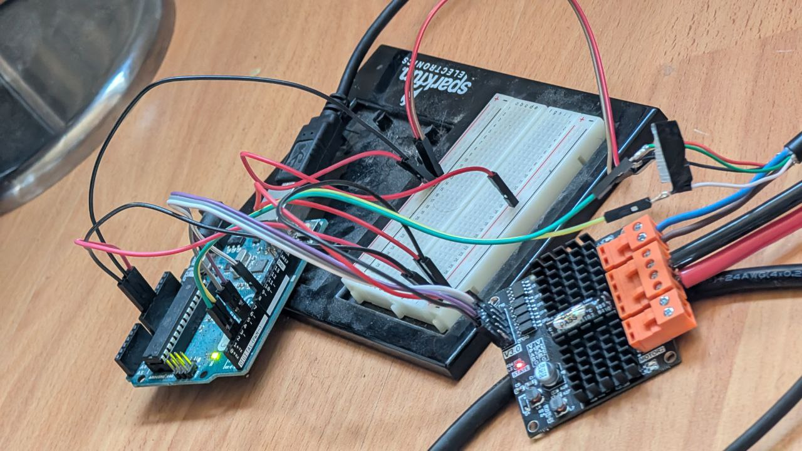

arduino-antuator-rs
=================

Rust project for the _Arduino Uno_.

## Build Instructions

> Windows specific instructions [here](https://dev.to/ryankopf/how-to-use-rust-on-arduino-windows-rust-143g)

1. Install prerequisites as described in the [`avr-hal` README] (`avr-gcc`, `avr-libc`, `avrdude`, [`ravedude`]).

2. Run `cargo build` to build the firmware.

3. Run `cargo run` to flash the firmware to a connected board.  If `ravedude`
   fails to detect your board, check its documentation at
   <https://crates.io/crates/ravedude>.

4. `ravedude` will open a console session after flashing where you can interact
   with the UART console of your board.

[`avr-hal` README]: https://github.com/Rahix/avr-hal#readme
[`ravedude`]: https://crates.io/crates/ravedude

## Hardware

* Dual-Channel DC Motor Driver - DFR0601 [[link](https://www.dfrobot.com/product-1861.html)] 
* Antuator Linear Actuator with hall effect sensor [[link](https://antuatorlinear.com/)]

### Wiring

See pictures of how it's wired in [/docs/wiring-pics](docs/wiring-pics).

