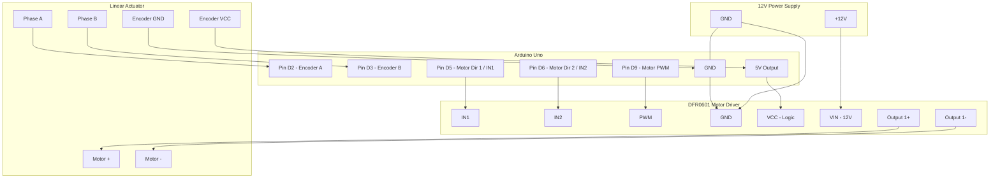

# Hardware Reference

This document covers the specific hardware components and their electrical connections.

## Components

### 1. Arduino Uno

* **Role**: Main microcontroller.
* **Logic Voltage**: 5V.

### 2. DFR0601 Dual-Channel DC Motor Driver

* **Link**: [Product Page](https://www.dfrobot.com/product-1861.html).

### 3. Antuator Linear Actuator

* **Feedback**: Built-in Hall effect sensor.
* **Voltage**: 12V DC.
* **Link**: [Technical Datasheet](../docs/荷兰+Antuator+房车.pdf).

## Wiring Diagram

